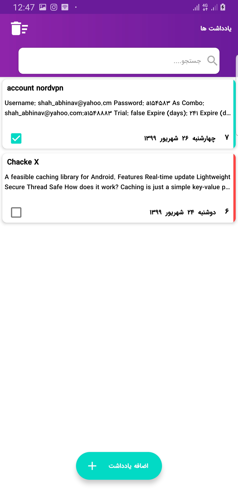
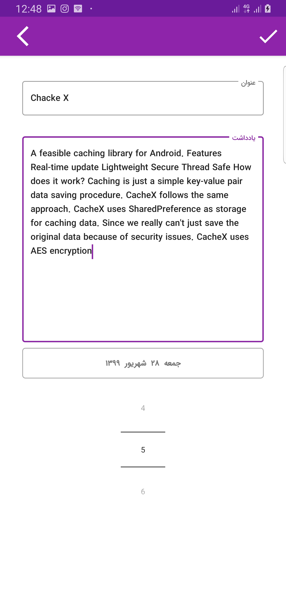
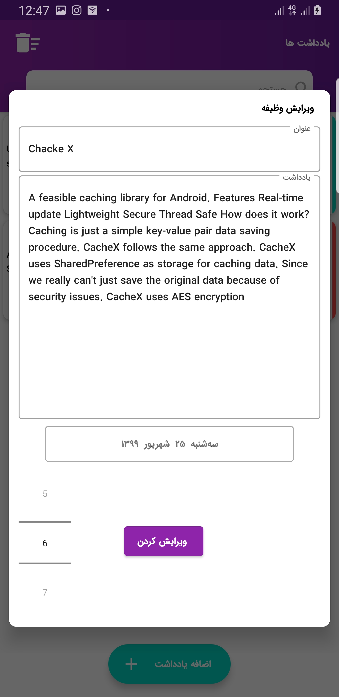

# Notes-App
open source Android project for learn latest trends on Android

Main ToDo | Add new ToDo | Update ToDo | Search ToDo |
--- | --- | --- | --- |
 |  |  |  |

# Technologies
- [Model–view–ViewModel architecture](https://www.journaldev.com/20292/android-mvvm-design-pattern)
- [AndroidX](https://developer.android.com/jetpack/androidx)
- [Android JetPack](https://developer.android.com/jetpack)
- [RxJava](https://github.com/ReactiveX/RxJava)
- [Lottie](https://airbnb.design/lottie/)
